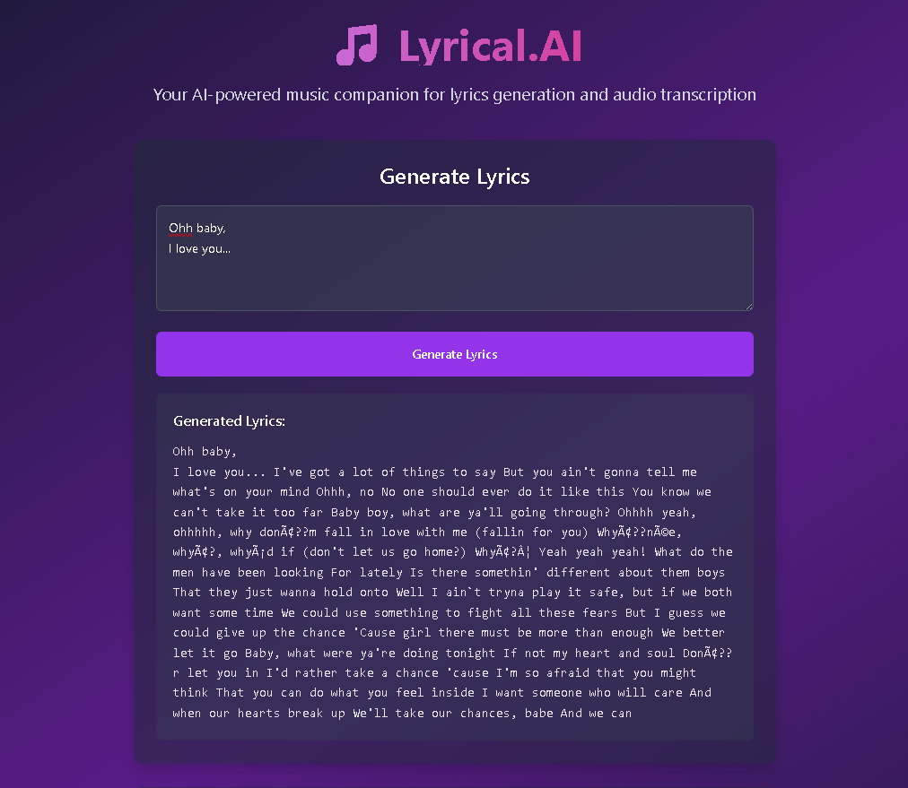
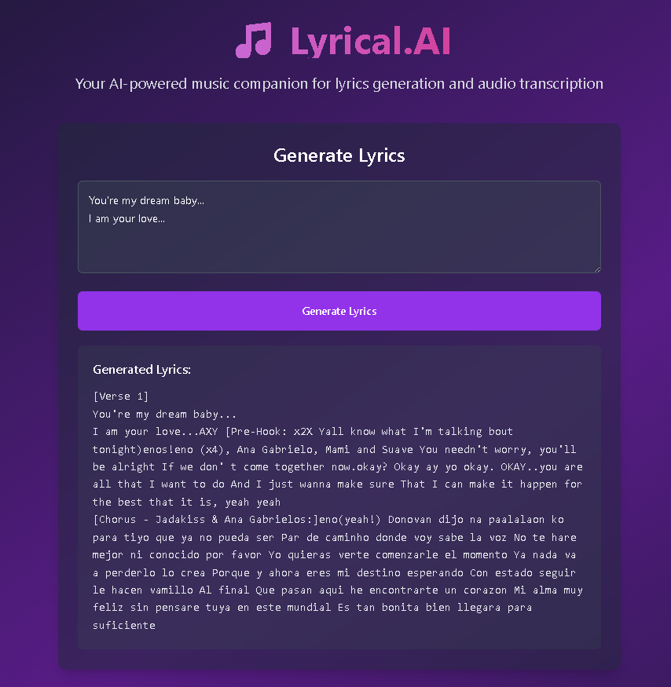

# 🎵 LyricalAI - AI-Powered Music Lyrics Generator

LyricalAI is an innovative web application that combines the power of AI to generate, transcribe, and enhance music lyrics. Built with modern technologies, it offers a seamless experience for musicians, songwriters, and music enthusiasts.

## 📸 Showcase

<div align="left">
  
  
</div>

<div align="left">
  <p><em>The main interface of LyricalAI showing the lyrics generation and audio transcription features with an AI-generated lyrics with proper section formatting.</em></p>
</div>

## ✨ Features

- **AI-Powered Lyrics Generation**: Generate creative and coherent lyrics using fine-tuned GPT-2 models  
- **Audio Transcription**: Convert speech to text using OpenAI's Whisper model  
- **Section-Based Formatting**: Automatically formats lyrics with proper verse, chorus, and bridge sections  
- **Modern Web Interface**: Clean and intuitive user interface for a great user experience  
- **Real-time Processing**: Fast and efficient processing of both text and audio inputs  

## 🌐 Try it on Hugging Face
- <a href="https://huggingface.co/spaces/harishchaurasia/lyrics-generator" target="_blank">Live Demo (Hugging Face Space)</a>  
- <a href="https://huggingface.co/harishchaurasia/gpt2-lyrics-model-fine-tuned" target="_blank">Fine-Tuned GPT-2 Lyrics Gen Model</a>

## 🛠️ Tech Stack

### Backend
- FastAPI (Python web framework)  
- GPT-2 (Fine-tuned on RTX 5080 GPU for lyrics generation)  
- Whisper (Speech-to-text)  
- PyTorch  
- Uvicorn (ASGI server)  
- Hugging Face  

### Frontend
- Vite  
- React.js  
- Modern CSS  
- Responsive Design  

## 🚀 Getting Started

### Prerequisites
- Python 3.8+  
- Node.js 14+  
- CUDA-compatible GPU (optional, for faster processing)

### Installation

1. Clone the repository:
```bash
git clone https://github.com/harishchaurasia/LyricalAI.git
cd LyricalAI
```

2. Set up the backend:
```bash
cd backend
python -m venv venv
source venv/bin/activate  # On Windows: venv\Scripts\activate
pip install -r requirements.txt
```

3. Set up the frontend:
```bash
cd frontend
npm install
```

### Running the Application

1. Start the backend server:
```bash
cd backend
uvicorn main:app --reload
```

2. Start the frontend development server:
```bash
cd frontend
npm start
```

The application will be available at `http://localhost:3000`

## 🎯 Usage

### Generating Lyrics
1. Enter a prompt or theme for your lyrics
2. Click "Generate" to create AI-powered lyrics
3. The generated lyrics will be formatted with proper sections (verse, chorus, bridge)

### Transcribing Audio
1. Upload an audio file (supported formats: WAV, MP3)
2. The system will automatically transcribe the audio to text
3. Use the transcription as a base for your lyrics

⚠️ Disclaimer:
- LyricalAI uses a fine-tuned GPT-2 model trained on approximately ~400k song lyrics. Due to the relatively small model size and limited dataset, it may occasionally produce inaccurate, repetitive, or nonsensical lyrics. These outputs do not reflect real artists, copyrighted material, or intended meanings. Use with discretion, especially in professional or public settings.

🤝 Contributions:
- Contributions are welcome! Please feel free to submit a Pull Request. For major changes, please open an issue first to discuss what you would like to change.

📝 License:
- This project is licensed under the MIT License - see the LICENSE file for details.

🙏 Acknowledgments:
- OpenAI for the Whisper model
- Hugging Face for the GPT-2 model
- All contributors and users of the project

📧 Contact:
- For any questions or suggestions, please open an issue in the repository.

Made with ❤️ by Harish Chaurasia
